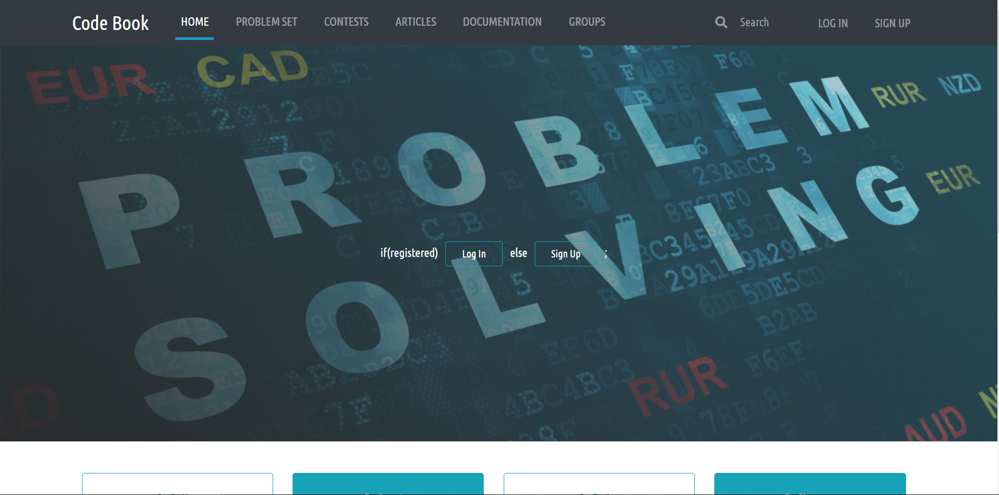
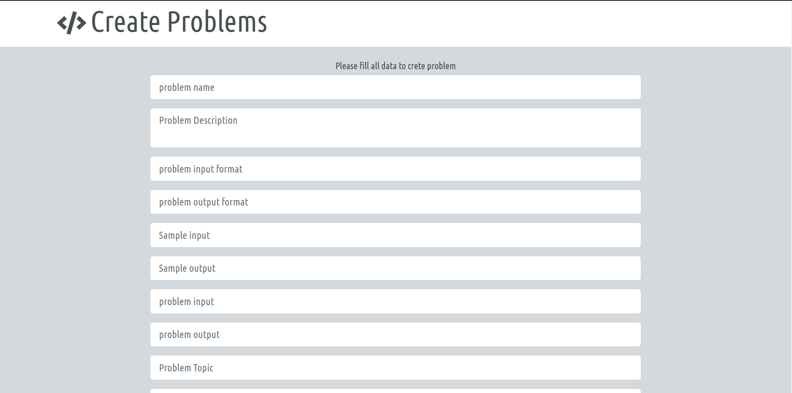

# code_book
<p align="center">
  <a href="" rel="noopener">
 </a>
</p>
<p align="center"> 🏆 Code Book.
    <br> 
</p>
<div align="center">
  
[](https://github.com/code_book/contributors)
[](https://github.com/gaserashraf/code_book/issues)
[](https://github.com/gaserashraf/code_book/network)
[](https://github.com/gaserashraf/code_book/stargazers)
[](https://github.com/gaserashraf/code_book/blob/master/LICENSE)

</div>


## 📝 Table of Contents

- [About](#about)
- [Screenshots](#Screenshots)
- [Get Started](#Install)
- [Technology](#tech)

## 📙 About <a name = "about"></a>
online website about competitive programming. The site offers explanations about topics related to competitive programming and articles written by experts. In addition, the main core of the site is to solve problems about competitive programming, so the site contains problems with variant difficulty levels. The user can submit his solution output and the site checks that output.
Each user can solve problems, see topics explanations, review articles, and can participate in official contests. On the other side come the developers, expert people for managing the site; these are responsible for putting problems and determine the input and output of each problem. Also, contributors write and edit materials of topics explanations.

## 🏁 Get Started <a name = "Install"></a>
1. **Excute Database**
- Install mysql
- Execute sql Script on mysql workbench
2. **Clone the repository**
```
git clone https://github.com/gaserashraf/code_book.git
```
```
cd code_book
```
3. **Change data connection in (routes/server.js)**
```
var connection = mysql.createConnection({
  host     : 'localhost',
  user     : 'root',
  password: 'password',//change to ur password
  database : 'NyZaKa',
});
```
4. **Running**
```
npm install
```
```
nodemon index
```
go to your browser and go to http://localhost:5000/


## 💻 Built Using <a name = "tech"></a>
- **MYSQL**
- **Nodejs**
- **Express**
- **HTML**
- **Some vanilla javascript**
- **SASS**
- **Bootstrap**
## 📷 Screenshots 

<div name="Screenshots" align="center">
   </a>
   </a>
   <hr>
   </a>
   </a>
   <hr>
   </a>
   <hr>
   </a>
   <hr>
   </a>
   </a>
   <hr>
   </a>
   <hr>
   </a>
   </a>
   <hr>
   </a>
   <hr>
   </a>
   </a>
   </a>
   </a>
   
</div>

### ✨ Contributors
<table>
  <tr>
    <td align="center"><a href="https://github.com/gaserashraf"><br /><sub><b>Gaser Ashraf</b></sub></a><br /></td>
     <td align="center"><a href="https://github.com/AdelRizq"><br /><sub><b>Mohamed Nabawe</b></sub></a><br /></td>
     <td align="center"><a href="https://github.com/aashrafh"><br /><sub><b>Yousef  Elshabrawy‬</b></sub></a><br /></td>
     <td align="center"><a href="https://github.com/Mahboub99"><br /><sub><b>Yousef Elmahdy</b></sub></a><br /></td>
  </tr>
 </table>


